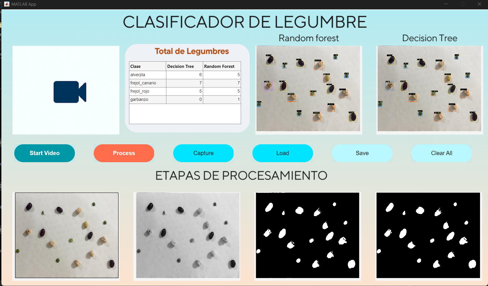

# MATLAB-LegumeClassifier 

Sistema de clasificación de legumbres mediante procesamiento de imágenes en MATLAB.

  

## Funcionalidades principales
- Escalado automático en centímetros usando hoja A5 como referencia.
- Procesamiento completo de imagen: binarización, filtrado morfológico, etiquetado y extracción de características.
- Extracción de descriptores: área, perímetro, circularidad, media RGB, desviación estándar, etc.
- Clasificación de legumbres mediante:
    - Árbol de decisión (fitctree)
    - Random Forest (TreeBagger)
- Entrenamiento supervisado con exportación de modelos entrenados.
- Interfaz visual (App Designer) para cargar, visualizar, entrenar y clasificar imágenes.

## Requisitos
 - MATLAB R2025a o superior
 - Toolboxes:
    - Image Processing Toolbox
    - Statistics and Machine Learning Toolbox
- App Designer
- Clasificadores: `fitctree`, `TreeBagger`    

## 📦 Estructura

    MATLAB-LegumeClassifier/
    ├── App.mlapp # Aplicación en App Designer
    |── AppExport.m
    ├── 📂 functions/            # Funciones de procesamiento y clasificación
    │   ├── 📂clasificar_models/
    │   │   ├── clasificar_legumbres.m
    │   │   └── analizar_legumbres.m
    │   ├── 📂procesamiento/
    │   │   └── procesamiento_img.m
    │   ├── 📂round-button/
    │   │   ├── round_button.m
    │   │   ├── round_button.html
    │   │   └── test_button.m
    │   ├── 📂uiaxes/
    │   │   └── mostrarImagenExpandida.m
    │   └── 📂utils/
    │       └── save_datacsv.m
    ├── 📂 data/                 # Imágenes de entrenamiento y prueba
    ├── 📂 trains/models         # Modelos entrenados (.mat)
    ├── 📂 results               
    ├── 📂 media                 # Images para test y UIX
    ├── 📂 utils/                # Funciones auxiliares
    └── README.md

##  Licencia 
MIT License. Puedes usar, modificar y compartir este proyecto libremente.